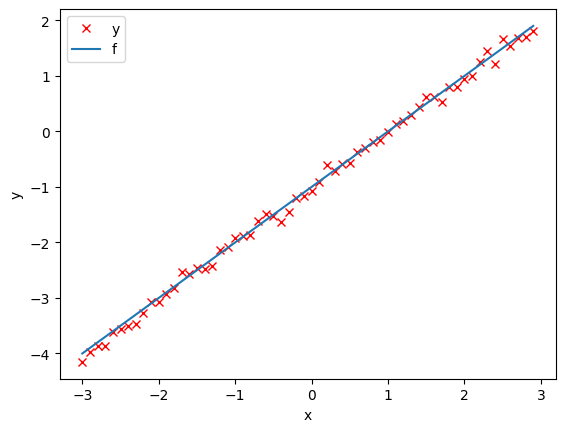
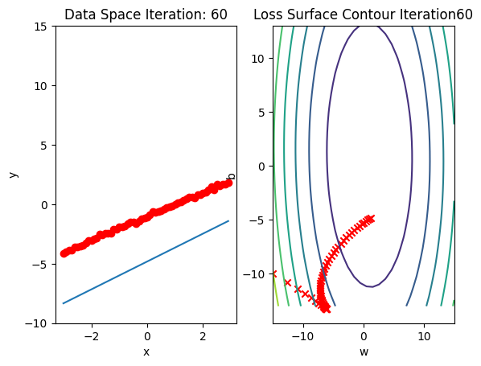
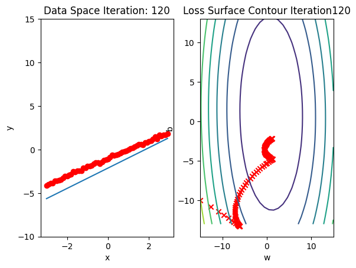
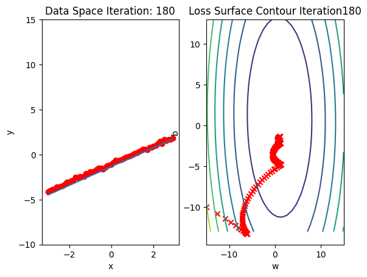
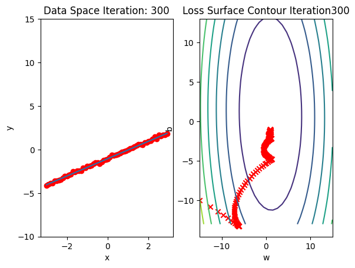
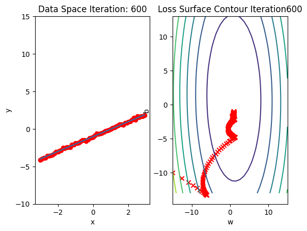

<p style="text-align:center">
    <a href="https://skills.network" target="_blank">
    
    </a>
</p>


<h1>Linear Regression 1D: Training Two Parameter Mini-Batch Gradient Descent </h1> 


<h2>Objective</h2><ul><li> How to use PyTorch build-in functions to create a model.</li></ul> 


<h2>Table of Contents</h2>
<p>In this lab, you will create a model the PyTroch way, this will help you as models get more complicated</p>

<ul>
    <li><a href="#Make-Some-Data">Make Some Data </a></li>
    <li><a href="#Create-the-Model-and-Total-Loss-Function-(Cost)">Create the Model and Total Loss Function (Cost) </a></li>
    <li><a href="#Train-the-Model:-Batch-Gradient-Descent">Train the Model: Batch Gradient Descent</a></li>
</ul>

<p>Estimated Time Needed: <strong>30 min</strong></p>

<hr>


<h2>Preparation</h2>


We'll need the following libraries:  


```python
# These are the libraries we are going to use in the lab.

import numpy as np
import matplotlib.pyplot as plt
from mpl_toolkits import mplot3d
```

The class <code>plot_error_surfaces</code> is just to help you visualize the data space and the parameter space during training and has nothing to do with PyTorch. 


```python
# class for ploting  

class plot_error_surfaces(object):
    
    # Constructor
    def __init__(self, w_range, b_range, X, Y, n_samples = 30, go = True):
        W = np.linspace(-w_range, w_range, n_samples)
        B = np.linspace(-b_range, b_range, n_samples)
        w, b = np.meshgrid(W, B)    
        Z = np.zeros((30, 30))
        count1 = 0
        self.y = Y.numpy()
        self.x = X.numpy()
        for w1, b1 in zip(w, b):
            count2 = 0
            for w2, b2 in zip(w1, b1):
                Z[count1, count2] = np.mean((self.y - w2 * self.x + b2) ** 2)
                count2 += 1
            count1 += 1
        self.Z = Z
        self.w = w
        self.b = b
        self.W = []
        self.B = []
        self.LOSS = []
        self.n = 0
        if go == True:
            plt.figure()
            plt.figure(figsize = (7.5, 5))
            plt.axes(projection = '3d').plot_surface(self.w, self.b, self.Z, rstride = 1, cstride = 1, cmap = 'viridis', edgecolor = 'none')
            plt.title('Loss Surface')
            plt.xlabel('w')
            plt.ylabel('b')
            plt.show()
            plt.figure()
            plt.title('Loss Surface Contour')
            plt.xlabel('w')
            plt.ylabel('b')
            plt.contour(self.w, self.b, self.Z)
            plt.show()
            
    # Setter
    def set_para_loss(self, model, loss):
        self.n = self.n + 1
        self.LOSS.append(loss)
        self.W.append(list(model.parameters())[0].item())
        self.B.append(list(model.parameters())[1].item())
    
    # Plot diagram
    def final_plot(self): 
        ax = plt.axes(projection = '3d')
        ax.plot_wireframe(self.w, self.b, self.Z)
        ax.scatter(self.W, self.B, self.LOSS, c = 'r', marker = 'x', s = 200, alpha = 1)
        plt.figure()
        plt.contour(self.w, self.b, self.Z)
        plt.scatter(self.W, self.B, c = 'r', marker = 'x')
        plt.xlabel('w')
        plt.ylabel('b')
        plt.show()
        
    # Plot diagram    
    def plot_ps(self):
        plt.subplot(121)
        plt.ylim()
        plt.plot(self.x, self.y, 'ro', label = "training points")
        plt.plot(self.x, self.W[-1] * self.x + self.B[-1], label = "estimated line")
        plt.xlabel('x')
        plt.ylabel('y')
        plt.ylim((-10, 15))
        plt.title('Data Space Iteration: ' + str(self.n))
        plt.subplot(122)
        plt.contour(self.w, self.b, self.Z)
        plt.scatter(self.W, self.B, c = 'r', marker = 'x')
        plt.title('Loss Surface Contour Iteration' + str(self.n) )
        plt.xlabel('w')
        plt.ylabel('b')
        plt.show()
```

<!--Empty Space for separating topics-->


<!-- <h2 id="Makeup_Data">Make Some Data</h2>
 -->
 ## Make Some Data


Import libraries and set random seed.


```python
# Import libraries and set random seed

import torch
from torch.utils.data import Dataset, DataLoader
torch.manual_seed(1)
```


    <torch._C.Generator at 0x73f9b4be1fb0>


Generate values from -3 to 3 that create a line with a slope of 1 and a bias of -1. This is the line that you need to estimate. Add some noise to the data:


```python
# Create Data Class

class Data(Dataset):
    
    # Constructor
    def __init__(self):
        self.x = torch.arange(-3, 3, 0.1).view(-1, 1)
        self.f = 1 * self.x - 1
        self.y = self.f + 0.1 * torch.randn(self.x.size())
        self.len = self.x.shape[0]
        
    # Getter
    def __getitem__(self,index):    
        return self.x[index],self.y[index]
    
    # Get Length
    def __len__(self):
        return self.len
```

Create a dataset object: 


```python
# Create dataset object

dataset = Data()
```

Plot out the data and the line.


```python
# Plot the data

plt.plot(dataset.x.numpy(), dataset.y.numpy(), 'rx', label = 'y')
plt.plot(dataset.x.numpy(), dataset.f.numpy(), label = 'f')
plt.xlabel('x')
plt.ylabel('y')
plt.legend()
```


    <matplotlib.legend.Legend at 0x73f990baffa0>


    

    


<!--Empty Space for separating topics-->


<!-- <h2 id="Model_Cost">Create the Model and Total Loss Function (Cost)</h2>
 -->
## Create the Model and Total Loss Function (Cost)


Create a linear regression class 


```python
# Create a linear regression model class

from torch import nn, optim

class linear_regression(nn.Module):
    
    # Constructor
    def __init__(self, input_size, output_size):
        super(linear_regression, self).__init__()
        self.linear = nn.Linear(input_size, output_size)
        
    # Prediction
    def forward(self, x):
        yhat = self.linear(x)
        return yhat
```

We will use PyTorch build-in functions to create a criterion function; this calculates the total loss or cost 


```python
# Build in cost function

criterion = nn.MSELoss()
```

Create a linear regression object and optimizer object, the optimizer object will use the linear regression object.


```python
# Create optimizer

model = linear_regression(1,1)
optimizer = optim.SGD(model.parameters(), lr = 0.01)
```


```python
list(model.parameters())
```


    [Parameter containing:
     tensor([[0.3636]], requires_grad=True),
     Parameter containing:
     tensor([0.4957], requires_grad=True)]


Remember to construct an optimizer you have to give it an iterable containing the parameters i.e. provide <code> model.parameters()</code> as an input to the object constructor 


Similar to the model, the optimizer has a state dictionary:


```python
optimizer.state_dict()
```


    {'state': {},
     'param_groups': [{'lr': 0.01,
       'momentum': 0,
       'dampening': 0,
       'weight_decay': 0,
       'nesterov': False,
       'maximize': False,
       'foreach': None,
       'differentiable': False,
       'fused': None,
       'params': [0, 1]}]}


Many of the keys correspond to more advanced optimizers.


Create a <code>Dataloader</code> object: 


```python
# Create Dataloader object

trainloader = DataLoader(dataset = dataset, batch_size = 1)
```

PyTorch randomly initialises your model parameters. If we use those parameters, the result will not be very insightful as convergence will be extremely fast. So we will initialise the parameters such that they will take longer to converge, i.e. look cool  


```python
# Customize the weight and bias

model.state_dict()['linear.weight'][0] = -15
model.state_dict()['linear.bias'][0] = -10
```

Create a plotting object, not part of PyTroch, just used to help visualize 


```python
# Create plot surface object

get_surface = plot_error_surfaces(15, 13, dataset.x, dataset.y, 30, go = False)
```

<!--Empty Space for separating topics-->


<!-- <h2 id="BGD">Train the Model via Batch Gradient Descent</h2>
 -->
 ## Train the Model: Batch Gradient Descent


Run 10 epochs of stochastic gradient descent: <b>bug</b> data space is 1 iteration ahead of parameter space. 


```python
# Train Model

def train_model_BGD(iter):
    for epoch in range(iter):
        for x,y in trainloader:
            yhat = model(x)
            loss = criterion(yhat, y)
            get_surface.set_para_loss(model, loss.tolist())          
            optimizer.zero_grad()
            loss.backward()

            optimizer.step()
        get_surface.plot_ps()


train_model_BGD(10)
```


    

    


    

    


    

    


    

    


    

    


    

    


    

    


    

    


    

    


    

    


```python
model.state_dict()
```


    OrderedDict([('linear.weight', tensor([[0.9932]])),
                 ('linear.bias', tensor([-1.0174]))])


Let's use the following diagram to help clarify the process. The model takes <code>x</code> to produce an estimate <code>yhat</code>, it will then be compared to the actual <code>y</code>  with the loss function.


When we call <code>backward()</code> on the loss function, it will handle the differentiation. Calling the method step on the optimizer object it will update the parameters as they were inputs when we constructed the optimizer object. The connection is shown in the following figure :


<!--Empty Space for separating topics-->


<h3>Practice</h3>


Try to train the model via BGD with <code>lr = 0.1</code>. Use <code>optimizer</code> and the following given variables.


```python
# Practice: Train the model via BGD using optimizer

model = linear_regression(1,1)
model.state_dict()['linear.weight'][0] = -15
model.state_dict()['linear.bias'][0] = -10
get_surface = plot_error_surfaces(15, 13, dataset.x, dataset.y, 30, go = False)
```


```python
optimizer = optim.SGD(model.parameters(), lr=0.01)
data_loader = DataLoader(dataset, batch_size=2)

def train_model(iter):
    for epoch in range(iter):
        for idx, (x, y) in enumerate(data_loader):
            # Forward pass 
            pred = model(x)

            # Loss 
            loss = criterion(pred, y) 

            # Zero grad 
            optimizer.zero_grad()

            # Backward pass 
            loss.backward()

            # Next iteration 
            optimizer.step()

        print(f"Epoch: {epoch} | Loss: {loss}")

train_model(10)
```

    Epoch: 0 | Loss: 182.4174346923828
    Epoch: 1 | Loss: 15.896391868591309
    Epoch: 2 | Loss: 2.6702027320861816
    Epoch: 3 | Loss: 0.5941413640975952
    Epoch: 4 | Loss: 0.13364765048027039
    Epoch: 5 | Loss: 0.024551399052143097
    Epoch: 6 | Loss: 0.0021412530913949013
    Epoch: 7 | Loss: 0.00024883903097361326
    Epoch: 8 | Loss: 0.0021291773300617933
    Epoch: 9 | Loss: 0.00396951287984848


Double-click <b>here</b> for the solution.

<!-- 
optimizer = optim.SGD(model.parameters(), lr = 0.1)
trainloader = DataLoader(dataset = dataset, batch_size = 1)

def my_train_model(iter):
    for epoch in range(iter):
        for x,y in trainloader:
            yhat = model(x)
            loss = criterion(yhat, y)
            get_surface.set_para_loss(model, loss.tolist()) 
            optimizer.zero_grad()
            loss.backward()
            optimizer.step()
        get_surface.plot_ps()

train_model_BGD(10)
-->


<a href="https://dataplatform.cloud.ibm.com/registration/stepone?utm_source=skills_network&utm_content=in_lab_content_link&utm_id=Lab-IBMDeveloperSkillsNetwork-DL0110EN-SkillsNetwork&context=cpdaas&apps=data_science_experience%2Cwatson_machine_learning"></a>


<!--Empty Space for separating topics-->


<h2>About the Authors:</h2> 

<a href="https://www.linkedin.com/in/joseph-s-50398b136/">Joseph Santarcangelo</a> has a PhD in Electrical Engineering, his research focused on using machine learning, signal processing, and computer vision to determine how videos impact human cognition. Joseph has been working for IBM since he completed his PhD.


Other contributors: <a href="https://www.linkedin.com/in/michelleccarey/">Michelle Carey</a>, <a href="https://www.linkedin.com/in/jiahui-mavis-zhou-a4537814a/">Mavis Zhou</a>


<!--
## Change Log

|  Date (YYYY-MM-DD) |  Version | Changed By  |  Change Description |
|---|---|---|---|
| 2020-09-23  | 2.0  | Shubham  |  Migrated Lab to Markdown and added to course repo in GitLab |
-->


<hr>


## <h3 align="center"> &#169; IBM Corporation. All rights reserved. <h3/>

