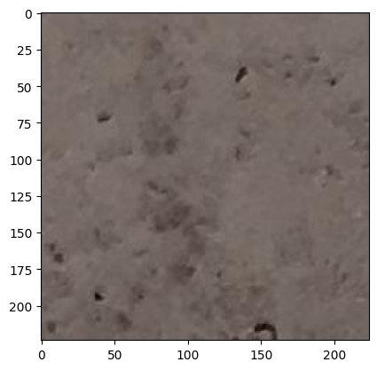
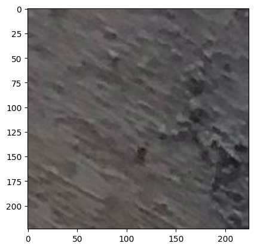
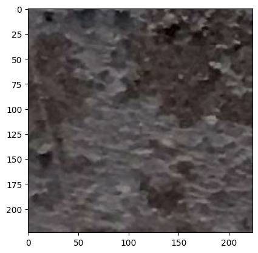
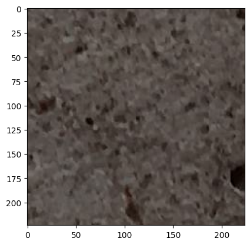
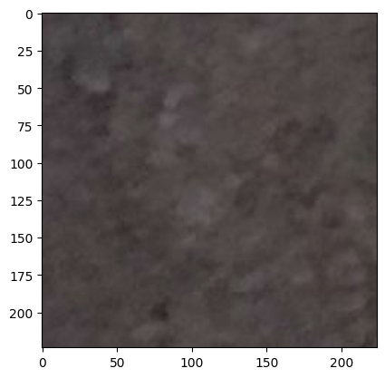

## Introduction


In this lab, you will build an image classifier using the VGG16 pre-trained model, and you will evaluate it and compare its performance to the model we built in the last module using the ResNet50 pre-trained model. Good luck!

## Table of Contents

<div class="alert alert-block alert-info" style="margin-top: 20px">

<font size = 3>    

1. <a href="#item41">Download Data 
2. <a href="#item42">Part 1</a>
3. <a href="#item43">Part 2</a>  
4. <a href="#item44">Part 3</a>  

</font>
    
</div>

   

<a id="item41"></a>

## Download Data

Use the <code>wget</code> command to download the data for this assignment from here: https://s3-api.us-geo.objectstorage.softlayer.net/cf-courses-data/CognitiveClass/DL0321EN/data/concrete_data_week4.zip

Use the following cells to download the data.


```python
# !wget https://s3-api.us-geo.objectstorage.softlayer.net/cf-courses-data/CognitiveClass/DL0321EN/data/concrete_data_week4.zip
```


```python
# !unzip -q concrete_data_week4.zip
```

After you unzip the data, you fill find the data has already been divided into a train, validation, and test sets.

  

<a id="item42"></a>

## Part 1

In this part, you will design a classifier using the VGG16 pre-trained model. Just like the ResNet50 model, you can import the model <code>VGG16</code> from <code>keras.applications</code>.

You will essentially build your classifier as follows:
1. Import libraries, modules, and packages you will need. Make sure to import the *preprocess_input* function from <code>keras.applications.vgg16</code>.
2. Use a batch size of 100 images for both training and validation.
3. Construct an ImageDataGenerator for the training set and another one for the validation set. VGG16 was originally trained on 224 × 224 images, so make sure to address that when defining the ImageDataGenerator instances.
4. Create a sequential model using Keras. Add VGG16 model to it and dense layer.
5. Compile the mode using the adam optimizer and the categorical_crossentropy loss function.
6. Fit the model on the augmented data using the ImageDataGenerators.

Use the following cells to create your classifier.


```python
from tensorflow.keras.preprocessing.image import ImageDataGenerator
from tensorflow.keras.applications.vgg16 import VGG16
from tensorflow.keras.models import Sequential
from tensorflow.keras.layers import Dense
from tensorflow.keras.optimizers import Adam
from tensorflow.keras.applications.vgg16 import preprocess_input
import tensorflow
import os
import numpy as np
import matplotlib.pyplot as plt
```


```python
train_batch_size, test_batch_size = 100, 100
image_resize = 224
```


```python
data_generator = ImageDataGenerator(preprocessing_function=preprocess_input)
```


```python
train_generator = data_generator.flow_from_directory(
    'concrete_data_week4/train',
    target_size=(image_resize, image_resize),
    batch_size=train_batch_size,
    class_mode='categorical')
```

    Found 30001 images belonging to 2 classes.


```python
valid_generator = data_generator.flow_from_directory(
    'concrete_data_week4/valid',
    target_size=(image_resize, image_resize),
    batch_size=train_batch_size,
    class_mode='categorical')
```

    Found 9501 images belonging to 2 classes.


```python
test_generator = data_generator.flow_from_directory(
    'concrete_data_week4/test',
    target_size=(image_resize, image_resize),
    batch_size=test_batch_size,
    class_mode='categorical', 
    shuffle=False)
```

    Found 500 images belonging to 2 classes.


```python
len(test_generator[0][0][:5])
```


    5


```python
# test_generator[0][0][:5]
```


```python
model = Sequential()
model.add(VGG16(
    include_top=False,
    pooling='avg',
    weights='imagenet',
    ))
model.add(Dense(2, activation='softmax'))
```


```python
model.layers
```


```python
model.layers[0].layers
```


```python
# Freezing VGG16 layers, as we don't want to train them
model.layers[0].trainable = False
```


```python
model.summary()
```


```python
model.compile(optimizer='adam', loss='categorical_crossentropy', metrics=['accuracy'])
```


```python
num_epochs = 2
steps_per_epoch_training = len(train_generator)
steps_per_epoch_validation = len(valid_generator)
```


```python
history = model.fit(
    train_generator,
    steps_per_epoch=steps_per_epoch_training,
    epochs=num_epochs,
    validation_data=valid_generator,
    validation_steps=steps_per_epoch_validation,
    verbose=1
)
```


```python
model.save('classifier_vgg16_model.h5')
```

## Part 2

In this part, you will evaluate your deep learning models on a test data. For this part, you will need to do the following:

1. Load your saved model that was built using the ResNet50 model. 
2. Construct an ImageDataGenerator for the test set. For this ImageDataGenerator instance, you only need to pass the directory of the test images, target size, and the **shuffle** parameter and set it to False.
3. Use the **evaluate_generator** method to evaluate your models on the test data, by passing the above ImageDataGenerator as an argument. You can learn more about **evaluate_generator** [here](https://keras.io/models/sequential/).
4. Print the performance of the classifier using the VGG16 pre-trained model.
5. Print the performance of the classifier using the ResNet pre-trained model.


Use the following cells to evaluate your models.


```python
vgg_model_path = 'classifier_vgg16_model.h5'
vgg_model = tensorflow.keras.models.load_model(vgg_model_path, compile=False)
vgg_model.compile(optimizer='adam', loss='categorical_crossentropy', metrics=['accuracy'])
vgg_model.summary()
```

    2025-03-08 13:16:41.246432: E external/local_xla/xla/stream_executor/cuda/cuda_driver.cc:152] failed call to cuInit: INTERNAL: CUDA error: Failed call to cuInit: UNKNOWN ERROR (303)


<pre style="white-space:pre;overflow-x:auto;line-height:normal;font-family:Menlo,'DejaVu Sans Mono',consolas,'Courier New',monospace"><span style="font-weight: bold">Model: "sequential"</span>
</pre>


<pre style="white-space:pre;overflow-x:auto;line-height:normal;font-family:Menlo,'DejaVu Sans Mono',consolas,'Courier New',monospace">┏━━━━━━━━━━━━━━━━━━━━━━━━━━━━━━━━━┳━━━━━━━━━━━━━━━━━━━━━━━━┳━━━━━━━━━━━━━━━┓
┃<span style="font-weight: bold"> Layer (type)                    </span>┃<span style="font-weight: bold"> Output Shape           </span>┃<span style="font-weight: bold">       Param # </span>┃
┡━━━━━━━━━━━━━━━━━━━━━━━━━━━━━━━━━╇━━━━━━━━━━━━━━━━━━━━━━━━╇━━━━━━━━━━━━━━━┩
│ vgg16 (<span style="color: #0087ff; text-decoration-color: #0087ff">Functional</span>)              │ (<span style="color: #00d7ff; text-decoration-color: #00d7ff">None</span>, <span style="color: #00af00; text-decoration-color: #00af00">512</span>)            │    <span style="color: #00af00; text-decoration-color: #00af00">14,714,688</span> │
├─────────────────────────────────┼────────────────────────┼───────────────┤
│ dense (<span style="color: #0087ff; text-decoration-color: #0087ff">Dense</span>)                   │ (<span style="color: #00d7ff; text-decoration-color: #00d7ff">None</span>, <span style="color: #00af00; text-decoration-color: #00af00">2</span>)              │         <span style="color: #00af00; text-decoration-color: #00af00">1,026</span> │
└─────────────────────────────────┴────────────────────────┴───────────────┘
</pre>


<pre style="white-space:pre;overflow-x:auto;line-height:normal;font-family:Menlo,'DejaVu Sans Mono',consolas,'Courier New',monospace"><span style="font-weight: bold"> Total params: </span><span style="color: #00af00; text-decoration-color: #00af00">14,715,714</span> (56.14 MB)
</pre>


<pre style="white-space:pre;overflow-x:auto;line-height:normal;font-family:Menlo,'DejaVu Sans Mono',consolas,'Courier New',monospace"><span style="font-weight: bold"> Trainable params: </span><span style="color: #00af00; text-decoration-color: #00af00">1,026</span> (4.01 KB)
</pre>


<pre style="white-space:pre;overflow-x:auto;line-height:normal;font-family:Menlo,'DejaVu Sans Mono',consolas,'Courier New',monospace"><span style="font-weight: bold"> Non-trainable params: </span><span style="color: #00af00; text-decoration-color: #00af00">14,714,688</span> (56.13 MB)
</pre>


```python
resnet_model_path = 'classifier_resnet_model.h5'
resnet_model = tensorflow.keras.models.load_model(resnet_model_path)
resnet_model.compile(optimizer='adam', loss='categorical_crossentropy', metrics=['accuracy'])
resnet_model.summary()
```

    WARNING:absl:Compiled the loaded model, but the compiled metrics have yet to be built. `model.compile_metrics` will be empty until you train or evaluate the model.


<pre style="white-space:pre;overflow-x:auto;line-height:normal;font-family:Menlo,'DejaVu Sans Mono',consolas,'Courier New',monospace"><span style="font-weight: bold">Model: "sequential"</span>
</pre>


<pre style="white-space:pre;overflow-x:auto;line-height:normal;font-family:Menlo,'DejaVu Sans Mono',consolas,'Courier New',monospace">┏━━━━━━━━━━━━━━━━━━━━━━━━━━━━━━━━━┳━━━━━━━━━━━━━━━━━━━━━━━━┳━━━━━━━━━━━━━━━┓
┃<span style="font-weight: bold"> Layer (type)                    </span>┃<span style="font-weight: bold"> Output Shape           </span>┃<span style="font-weight: bold">       Param # </span>┃
┡━━━━━━━━━━━━━━━━━━━━━━━━━━━━━━━━━╇━━━━━━━━━━━━━━━━━━━━━━━━╇━━━━━━━━━━━━━━━┩
│ resnet50 (<span style="color: #0087ff; text-decoration-color: #0087ff">Functional</span>)           │ (<span style="color: #00d7ff; text-decoration-color: #00d7ff">None</span>, <span style="color: #00af00; text-decoration-color: #00af00">2048</span>)           │    <span style="color: #00af00; text-decoration-color: #00af00">23,587,712</span> │
├─────────────────────────────────┼────────────────────────┼───────────────┤
│ dense (<span style="color: #0087ff; text-decoration-color: #0087ff">Dense</span>)                   │ (<span style="color: #00d7ff; text-decoration-color: #00d7ff">None</span>, <span style="color: #00af00; text-decoration-color: #00af00">2</span>)              │         <span style="color: #00af00; text-decoration-color: #00af00">4,098</span> │
└─────────────────────────────────┴────────────────────────┴───────────────┘
</pre>


<pre style="white-space:pre;overflow-x:auto;line-height:normal;font-family:Menlo,'DejaVu Sans Mono',consolas,'Courier New',monospace"><span style="font-weight: bold"> Total params: </span><span style="color: #00af00; text-decoration-color: #00af00">23,591,810</span> (90.00 MB)
</pre>


<pre style="white-space:pre;overflow-x:auto;line-height:normal;font-family:Menlo,'DejaVu Sans Mono',consolas,'Courier New',monospace"><span style="font-weight: bold"> Trainable params: </span><span style="color: #00af00; text-decoration-color: #00af00">4,098</span> (16.01 KB)
</pre>


<pre style="white-space:pre;overflow-x:auto;line-height:normal;font-family:Menlo,'DejaVu Sans Mono',consolas,'Courier New',monospace"><span style="font-weight: bold"> Non-trainable params: </span><span style="color: #00af00; text-decoration-color: #00af00">23,587,712</span> (89.98 MB)
</pre>


```python
# Evaluating the model vgg16 on the test data
loss, accuracy = vgg_model.evaluate(test_generator, steps=len(test_generator), verbose=1)
print("Test accuracy using VGG16 model: ", accuracy)
```

    /home/vasim/.venv/lib/python3.12/site-packages/keras/src/trainers/data_adapters/py_dataset_adapter.py:121: UserWarning: Your `PyDataset` class should call `super().__init__(**kwargs)` in its constructor. `**kwargs` can include `workers`, `use_multiprocessing`, `max_queue_size`. Do not pass these arguments to `fit()`, as they will be ignored.
      self._warn_if_super_not_called()
    2025-03-08 13:17:00.801060: W external/local_xla/xla/tsl/framework/cpu_allocator_impl.cc:83] Allocation of 1284505600 exceeds 10% of free system memory.
    2025-03-08 13:17:01.754689: W external/local_xla/xla/tsl/framework/cpu_allocator_impl.cc:83] Allocation of 1284505600 exceeds 10% of free system memory.
    2025-03-08 13:17:05.449616: W external/local_xla/xla/tsl/framework/cpu_allocator_impl.cc:83] Allocation of 321126400 exceeds 10% of free system memory.
    2025-03-08 13:17:05.741730: W external/local_xla/xla/tsl/framework/cpu_allocator_impl.cc:83] Allocation of 642252800 exceeds 10% of free system memory.
    2025-03-08 13:17:07.382609: W external/local_xla/xla/tsl/framework/cpu_allocator_impl.cc:83] Allocation of 642252800 exceeds 10% of free system memory.


    5/5 ━━━━━━━━━━━━━━━━━━━━ 150s 30s/step - accuracy: 0.9989 - loss: 0.0147
    Test accuracy using VGG16 model:  0.9980000257492065


```python
# Evaluating the model vgg16 on the test data
loss, accuracy = resnet_model.evaluate(test_generator, steps=len(test_generator), verbose=1)
print("Test accuracy using ResNet model: ", accuracy)
```

    5/5 ━━━━━━━━━━━━━━━━━━━━ 62s 12s/step - accuracy: 0.9983 - loss: 0.0044
    Test accuracy using ResNet model:  0.9959999918937683


## Part 3

In this model, you will predict whether the images in the test data are images of cracked concrete or not. You will do the following:

1. Use the **predict_generator** method to predict the class of the images in the test data, by passing the test data ImageDataGenerator instance defined in the previous part as an argument. You can learn more about the **predict_generator** method [here](https://keras.io/models/sequential/).
2. Report the class predictions of the first five images in the test set. You should print something list this:


    <ul style="list-style-type:none">
        <li>Positive</li>  
        <li>Negative</li> 
        <li>Positive</li>
        <li>Positive</li>
        <li>Negative</li>
    </ul>


Use the following cells to make your predictions.


```python
from tensorflow.keras.activations import softmax, sigmoid
```


```python
len(test_generator[0][0][:5])
```


    5


```python
import matplotlib.pyplot as plt

for i, img in enumerate(test_generator[0][0][:5]):
    img = img / 255
    plt.imshow(img)
    plt.show()
```

    WARNING:matplotlib.image:Clipping input data to the valid range for imshow with RGB data ([0..1] for floats or [0..255] for integers). Got range [-0.0065882364..0.5923961].


    

    


    

    


    WARNING:matplotlib.image:Clipping input data to the valid range for imshow with RGB data ([0..1] for floats or [0..255] for integers). Got range [-0.02619608..0.57278824].


    

    


    WARNING:matplotlib.image:Clipping input data to the valid range for imshow with RGB data ([0..1] for floats or [0..255] for integers). Got range [-0.06541177..0.52180785].


    

    


    

    


```python
vgg_predictions = vgg_model.predict(test_generator[0][0][:5])
vgg_predictions
```

    1/1 ━━━━━━━━━━━━━━━━━━━━ 1s 1s/step


    array([[0.99669707, 0.00330299],
           [0.97390795, 0.02609208],
           [0.9155596 , 0.08444035],
           [0.98279494, 0.01720499],
           [0.97812814, 0.02187189]], dtype=float32)


```python
vgg_predictions = softmax(vgg_predictions)
vgg_predictions
```


    <tf.Tensor: shape=(5, 2), dtype=float32, numpy=
    array([[0.7297578 , 0.2702422 ],
           [0.72067577, 0.2793243 ],
           [0.6965915 , 0.30340844],
           [0.7242396 , 0.27576038],
           [0.7223716 , 0.27762836]], dtype=float32)>


```python
vgg_label_indices = np.argmax(vgg_predictions, axis=1)
vgg_label_indices
```


    array([0, 0, 0, 0, 0])


```python
# Define class labels
class_labels = ["Negative", "Positive"]

# Negative: No crack
# Positive: Crack

# Convert indices to labels
vgg_predicted_labels = [class_labels[idx] for idx in vgg_label_indices]
vgg_predicted_labels
```


    ['Negative', 'Negative', 'Negative', 'Negative', 'Negative']


```python
resnet_predictions = resnet_model.predict(test_generator[0][0][:5])
resnet_predictions
```

    1/1 ━━━━━━━━━━━━━━━━━━━━ 0s 436ms/step


    array([[9.9972039e-01, 2.7959453e-04],
           [9.9525511e-01, 4.7448617e-03],
           [9.9187332e-01, 8.1266146e-03],
           [9.9866652e-01, 1.3335263e-03],
           [9.9889708e-01, 1.1029537e-03]], dtype=float32)


```python
resnet_predictions = softmax(resnet_predictions)
resnet_predictions
```


    <tf.Tensor: shape=(5, 2), dtype=float32, numpy=
    array([[0.61289924, 0.38710076],
           [0.608581  , 0.39141902],
           [0.5970487 , 0.4029513 ],
           [0.61027753, 0.38972238],
           [0.60938865, 0.39061132]], dtype=float32)>


```python
resnet_label_indices = np.argmax(resnet_predictions, axis=1)
resnet_label_indices
```


    array([0, 0, 0, 0, 0])


```python
# Convert indices to labels
resnet_predicted_labels = [class_labels[idx] for idx in resnet_label_indices]
resnet_predicted_labels
```


    ['Negative', 'Negative', 'Negative', 'Negative', 'Negative']


### Thank you for completing this lab!

This notebook was created by Alex Aklson.

This notebook is part of a course on **Coursera** called *AI Capstone Project with Deep Learning*. If you accessed this notebook outside the course, you can take this course online by clicking [here](https://cocl.us/DL0321EN_Coursera_Week4_LAB1).

<hr>

Copyright &copy; 2020 [IBM Developer Skills Network](https://cognitiveclass.ai/?utm_source=bducopyrightlink&utm_medium=dswb&utm_campaign=bdu). This notebook and its source code are released under the terms of the [MIT License](https://bigdatauniversity.com/mit-license/).
