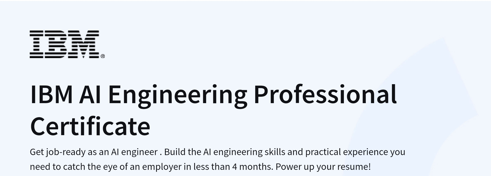

# IBM-AI-Engineering Professional Certificate

| # | Title | Folder | Labs |
|---------------|--------------|-------------|-----------|
| 01 | Machine Learning With Python | [Folder](<01. Machine Learning>) | [Labs](<01. Machine Learning/Labs>) |
| 02 | Introduction To Deep Learning With Keras | [Folder](<02. Intro To DL With Keras>) | [Labs](<02. Intro To DL With Keras/Labs>) |
| 03 | Deep Learning With Keras | [Folder](<03. DL With Keras>) | [Labs](<03. DL With Keras/Labs>) |
| 04 | Introduction To Deep Learning With PyTorch | [Folder](<04. Intro To DL With PyTorch>) | [Labs](<04. Intro To DL With PyTorch/Labs>) |
| 05 | Deep Learning With PyTorch | [Folder](<05. DL With PyTorch/Labs>) | [Labs](<05. DL With PyTorch/Labs>) |
| 06 | AI Capstone Project With Deep Learning | [Folder](<06. AI Capstone Project With DL>) | [Labs](<06. AI Capstone Project With DL/Labs>) |
| 07 | Generative AI & LLMs: Architecture & Data Preparation | [Folder](<07. GenAI-LLMs: Architecture and Data Preparation>) | [Labs](<07. GenAI-LLMs: Architecture and Data Preparation/Labs>) |
| 08 | Gen AI Foundational Models for NLP & Language Understanding | [Folder](<08. GenAI Foundational Models>) | [Labs](<08. GenAI Foundational Models/Labs>) |
| 09 | Generative AI Language Modeling With Transformers | [Folder](<09. GenAI Language Modeling/Labs>) | [Labs](<09. GenAI Language Modeling/Labs>) |
| 10 | Generative AI Engineering & Fine-Tuning Transformers | [Folder](<10. GenAI Engineering & Fine-Tuning>) | [Labs](<10. GenAI Engineering & Fine-Tuning/Labs>) |
| 11 | Generative AI Advance Fine-Tuning for LLMs | [Folder](<11. GenAI Advance LLMs Finetuning>) | [Labs](<11. GenAI Advance LLMs Finetuning/Labs>) |
| 12 | Fundamentals of AI Agents Using RAG and LangChain | [Folder](<12. Fundamentals of AI Agents-RAG-LangChain>) | [Labs](<12. Fundamentals of AI Agents-RAG-LangChain/Labs>) |
| 13 | Project: Generative AI Applications with RAG and LangChain | [Folder](<13. Project: GenAI Applications with RAG & LangChain>) | [Labs](<13. Project: GenAI Applications with RAG & LangChain/Labs>) |

